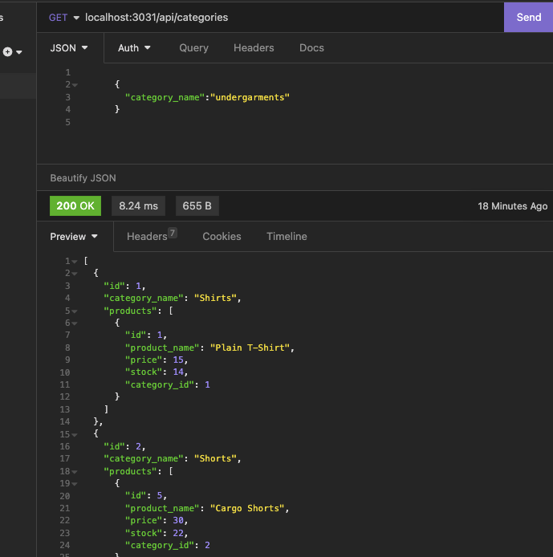

# E-commerce Back-End

## Table of Contents

- [Description](#description)
- [installation](#installation)
- [Usage](#usage)
- [License](#license)
- [Contributing](#contributing)
- [Tests](#tests)
- [Questions](#questions)

## Description

This is the back-end forman e-commerce site. This app uses Express.js API an uses it to configure it to use Sequelize to interact with MySQL database.

## Installation

This project requires the installation of MySQL2 and Sequelize packages as well as the dotenv package.

## Usage

When one opens API GET routes in Insomnia Core for categories, products, or tags then the data for each of this routes is displayed in a formatted JSON. When one tests the API POST, PUT, and DELETE routes in Insomnia Core then one is able to successfuly create, update, and delete data in the database.

## License

Licensed under the [MIT](http://choosealicense.com/licenses/mit/) license.

## Contributing

## Tests

## Questions

[ The URL of the GitHub application.](https://github.com/LizaS2022/ecommerce-app-project.git)
[The URL of the walkthrough video](https://drive.google.com/file/d/1FH2kibwps6PKddjBjFYoOk-WTa9gG2p_/view).
